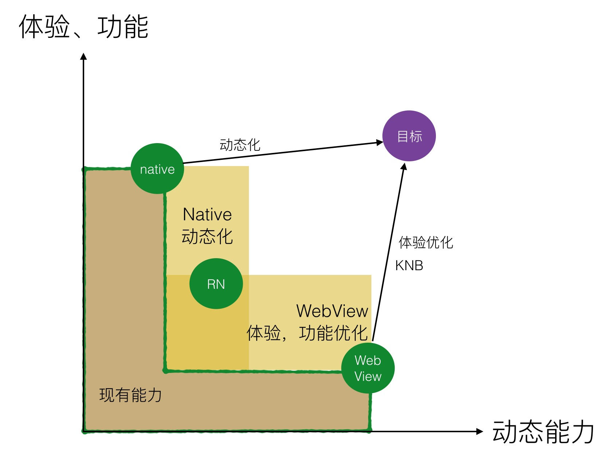

# Hybrid前端开发

## 目录
1. [WebView相关](#webview相关)

    1. [Native提供给Hybrid宿主环境（WebView）](#native提供给hybrid宿主环境webview)
    1. [WebView的前端处理](#webview的前端处理)
    1. [WebView性能](#webview性能)
1. [其他语言2Native](#其他语言2native)

---
>Hybrid App：狭义上是App内嵌WebView组件，再在WebView上使用页面的方案。广义上包括所有App混合方案，包括WebView方案、其他语言2Native方案、等。

## WebView相关

><details>
><summary>WebView种类</summary>
>
>1. iOS：
>
>    官方：[WKWebView](https://developer.apple.com/documentation/webkit/wkwebview)、[UIWebView](https://developer.apple.com/documentation/uikit/uiwebview)（不推荐）
>2. Android：
>
>    1. 官方：[WebView](https://developer.android.com/reference/android/webkit/WebView)
>    2. 第三方：[X5](https://x5.tencent.com/)、[AgentWeb](https://github.com/Justson/AgentWeb)、等
></details>

### Native提供给Hybrid宿主环境（WebView）
><details>
><summary>JS引擎：一个专门处理JS脚本的虚拟机</summary>
>
>手机中的JS引擎：
>
>1. Android运用的JS引擎：Google的[V8](https://github.com/v8/v8)。
>2. iOS运行的JS引擎：Apple的[JavaScriptCore](https://developer.apple.com/documentation/javascriptcore)。
>
>>还有其他JS引擎：SpiderMonkey、Rhino、等。
></details>

Hybrid底层依赖Native提供的容器（WebView），上层使用HTML、CSS、JS进行业务开发。

>小程序是WebView+Native的双线程模型。

1. 互相调用：

    1. Native调用WebView的JS方法（`window.前端定义方法`）
    2. WebView调用`桥协议`（`window.客户端定义方法`）、或触发`自定义URL Scheme`（`myscheme://客户端定义路径`）
2. 资源访问机制

    1. 以本地协议`file`方式访问Native内部资源。

        - 可以把前端要用的静态资源放到客户端本地（如：字体文件），本地页面通过类似`file:///android_asset/fonts/myFont.ttf`引用。
    2. 以远程`URL`方式访问线上资源（http/https）。
    3. 增量替换机制（不依赖发包更新）

        1. Native包内下载、解压线上的打包资源，再替换旧资源。
        2. ~~manifest~~
    4. URL限定，限制访问、跨域问题的解决方案

        1. 可以限制WebView的能发起的请求内容。
        2. 可以代替WebView进行会触发跨域的AJAX请求。
3. 页面在客户端内打开方式

    1. 针对产品功能性页面：

        用本地协议`file`方式打开客户端包内.html（.js、.css、图片等都在客户端包内）。

        - `file`打开的页面直接发起请求可能会有跨域问题，可以用客户端接口代理的方式请求服务端数据。
    2. 针对运营活动页面：

        用远程`URL`方式请求。
4. 身份验证机制

    Native创建WebView时，根据客户端登录情况注入跟登录有关的cookie（session_id）或token。
5. 开发测试

    1. 提供**切换成线上资源请求方式**的功能，用代理工具代理成本地资源。

### WebView的前端处理
1. 与Native配合方式：

    >1. 都是以**字符串**（数据用JSON字符串）的形式交互，向客户端传递：
    >
    >    1. 全局的方法名 -> 客户端调用`window.方法名(JSON数据)`
    >    2. 匿名函数 -> 客户端调用`(匿名函数(JSON数据))`
    >2. WebView无法判断是否安装了其他App。
    >3. 可以通过`查看注入的全局方法`、或`客户端调用回调函数`（、或`navigator.userAgent`）来判定页面是否在具体App内打开。
    >4. `桥协议`仅在App内部起作用；`自定义URL Scheme`是系统层面，所以可以额外针对跨App起作用（如：分享去其他App）；iOS的**通用链接**可以认为是高级的`自定义URL Scheme`。
    >5. Native和WebView交互需要时间，对时效性很高的操作会有问题。

    1. `桥协议`：Native注入全局方法至WebView的`window`，WebView调用则客户端拦截后触发Native行为。

        >1. 客户端注入方式：javascript伪协议方式`javascript: 代码`。
        >2. 注入JS代码可以在创建WebView之前（`[native code]`）或之后（全局变量JS注入）。
        >- 若注入的方法为`undefined`，则认为不在此App内部。
    2. `自定义URL Scheme`：拦截跳转（`<iframe>`或``设置`src`、点击`<a>`、`window.location.href`），触发Native行为。

        ><details>
        ><summary><code>URL Scheme</code></summary>
        >
        >是iOS和Android提供给开发者的一种WAP唤醒Native App方式（客户端用DeepLink实现）。Android应用在mainfest中注册自己的Scheme；iOS应用在App属性中配置。典型的URL Scheme：`myscheme://my.hostxxxxxxx`。
        ></details>

        >1. 客户端可以捕获、拦截任何行为（如：`console`、`alert`）。相对于注入全局变量，拦截方式可以隐藏具体JS业务代码，且不会被重载，方便针对不可控的环境。
        >2. 有些App会设置允许跳转的其他App的白名单或黑名单（记录其他APP的Scheme），如：微信白名单。
        >3. 除了增加回调函数且被客户端调用，否则无法准确判定是否在此App内部。
        >4. 跨App使用`自定义URL Scheme`，其后面的字符串要产生的行为仅目的App能理解。
        >5. 快速触发多次`自定义URL Scheme`，有时仅有最后一个产生效果。e.g. 用`window.location.href`快速触发多次，仅有最后一次跳转信息能够传递给客户端。

        1. iOS

            1. iOS8-

                ```javascript
                var iframe = document.createElement('iframe');
                iframe.src = '自定义URL Scheme';
                iframe.style.display = 'none';
                document.body.appendChild(iframe);
                setTimeout(function () {
                  document.body.removeChild(iframe);
                }, 3000);

                location.href = '下载地址';
                ```
            2. iOS9+

                >`<iframe>`无效。

                ```javascript
                location.href = '自定义URL Scheme';

                setTimeout(function () {
                  location.href = '下载地址';
                }, 250);
                setTimeout(function () {
                  location.reload();
                }, 1000);
                ```
            3. iOS9+的Universal links（通用链接），可以从底层打开其他App客户端，跳过白名单（微信已禁用）

                >需要HTTPS域名配置、iOS设置等其他端配合。

                >参考：[通用链接（Universal Links）的使用详解](http://www.hangge.com/blog/cache/detail_1554.html)、[Universal Link 前端部署采坑记](http://awhisper.github.io/2017/09/02/universallink/)、[Support Universal Links](https://developer.apple.com/library/content/documentation/General/Conceptual/AppSearch/UniversalLinks.html#//apple_ref/doc/uid/TP40016308-CH12-SW2)。
        2. Android

            ```javascript
            location.href = '自定义URL Scheme';	  // 也可以用`<iframe>`

            var start = Date.now();
            setTimeout(function () {    // 尝试通过上面的唤起方式唤起本地客户端，若唤起超时（还在这个页面），则直接跳转到下载页（或做其他未安装App的事情）（浏览器非激活时，定时器执行时间会变慢/主线程被占用，所以会大于定时器时间之后才执行定时器内回调）
              if (Date.now() - start < 3100) {  // 还在这个页面，认为没有安装App
                location.href = '下载地址';
              }
            }, 3000);
            ```

        - 在WebView中通过应用宝页面**下载/打开**其他APP

            >参考：[关于微信中直接调起 Native App 的调研报告](https://blog.csdn.net/lixuepeng_001/article/details/78043418)。

            1. iOS：应用宝页面支持跳转至目标APP的App Store
            2. Android：应用宝页面支持下载/打开目标APP

                1. 在腾讯系APP中能识别是否安装了目标APP；在其他APP中无法判断。
                2. 填写`android_schema`可以传递信息至目标APP：腾讯系APP打开目标APP后会带着信息；其他APP会先触发一次信息。
                - 不用安装应用宝就支持打开目标APP功能；下载是去应用宝下载（会先要求安装应用宝APP）。

            - 拼接应用宝下载/打开目标APP的链接：

                1. 应用宝主链接：`https://a.app.qq.com/o/simple.jsp?`
                2. 跳转参数（search值，在`?`后面，用`&`分割）:

                    1. APP包名：`pkgname=` + `com.xx.xxx`
                    2. 渠道包链接（可选）：`ckey=` + `CK1234567890123`
                    3. 目标APP内打开路径（可选）：`android_schema=` + `自定义URL Scheme://具体跳转路径`

                        >若有一些特殊字符，则可以用`encodeURIComponent`转义属性名和属性值。

                e.g. `https://a.app.qq.com/o/simple.jsp?pkgname=com.xx.xxx&ckey=xxxx&android_schema=xxxx://xx`

        >1. 微信分享在部分系统（低于微信客户端Android6.2）使用~~pushState~~导致签名失败，可查询[官方文档](https://mp.weixin.qq.com/wiki?t=resource/res_main&id=mp1421141115)；又因为一般是异步加载、配置微信的设置，所以要等待微信第三方文件和接口完成后才能够配置成功（才能够设置成功）。
        >2. Android的微信、QQ等X5内核可以用<http://debugx5.qq.com/>打开调试，支持「清除缓存」等操作。
        >
        >    iOS可以在 设置->通用->存储空间 清理缓存。
        >3. 长按没有 ~~`src`~~ 的``：
        >
        >    1. 在iOS微信WebView，截屏这个``所在位置；
        >    2. 其他情况，可能导致保存图片错误、或不能进行保存。
    3. WebView提供给Native调用的全局回调函数（或匿名函数）。

        ><details>
        ><summary>对于动态创建的全局回调函数，要注意同名覆盖问题</summary>
        >
        >e.g.
        >
        >```javascript
        >let _localCounter = 1 // 同一个方法名快速请求时，可能 Date.now() 还没有变化
        >
        >function invokeJSBridge (method, arg, { hasCallback = true }) {
        >  return new Promise((resolve, reject) => {
        >    if (typeof window.客户端定义方法 === 'function') {
        >      let callbackName = ''
        >
        >      // 创建客户端回调
        >      if (hasCallback) {
        >        callbackName = `${method}CallbackName_${_localCounter}`
        >        _localCounter += 1
        >
        >        window[callbackName] = (res) => {    // todo: 增加定时器处理长时间未被客户端回调的方法
        >          try {
        >            resolve({ result: 'ok', data: JSON.parse(res) })
        >          } catch (e) {
        >            resolve({ result: 'error', data: res })
        >          }
        >          window[callbackName] = null
        >        }
        >      }
        >
        >      // 调用客户端方法
        >      window.客户端定义方法( // 桥协议
        >        method, // 方法名
        >        JSON.stringify(arg || {}),  // 传参
        >        callbackName  // 回调
        >      )
        >
        >      // 无客户端回调时直接完成
        >      if (!hasCallback) {
        >        resolve({ result: 'ok', data: '' })
        >      }
        >    } else {
        >      reject(arg)
        >    }
        >  })
        >}
        >
        >
        >/* 使用测试 */
        >invokeJSBridge('方法名', '参数')
        >  .then((res) => {  // 是客户端、且调用成功&&客户端执行回调
        >    // 根据res处理客户端执行之后业务
        >  })
        >  .catch((res) => { // 不是客户端
        >    // 非客户端业务
        >  })
        >```
        ></details>
    >接口设计可以带有「透传数据」：前端调用客户端方法时多传一个透传参数，之后客户端异步调用前端方法时带着这个参数的值。
2. 根据WebView的[错误处理机制](https://github.com/realgeoffrey/knowledge/blob/master/网站前端/JS学习笔记/README.md#错误处理机制)统计用户在WebView遇到的bug。
3. [WebView调试](https://github.com/realgeoffrey/knowledge/blob/master/网站前端/代码调试相关/README.md#webview调试)
4. 分享到其他App

    1. 通过JS触发Native App之间的切换分享（自己Native内可用桥协议，任意App均要起作用只能用Scheme）。
    2. 带分享信息参数去访问目标App提供的分享URL。
5. [响应式页面解决方案](https://github.com/realgeoffrey/knowledge/blob/master/网站前端/HTML+CSS学习笔记/响应式相关.md#响应式页面解决方案)
6. 客户端内的前端页面，添加半屏弹窗策略：

    针对通用的逻辑，要给多个前端页面添加半屏弹窗逻辑。如：某个后台接口返回错误码，统一弹出半屏弹窗。

    1. 提前注入弹窗DOM和逻辑，需要触发时调用。
    2. 需要触发时动态注入弹窗DOM和逻辑，再调用。
    3. 新制作一个前端的弹窗页面，需要触发时在原页面上层覆盖这个半屏弹窗页面。
    4. 客户端提供bridge或Scheme用于弹出客户端的弹窗，需要触发时唤起客户端的弹窗。

### WebView性能
>参考：[WebView性能、体验分析与优化](https://tech.meituan.com/2017/06/09/webviewperf.html)。

1. 原生实现 VS. 页面实现

    1. Native App

        1. 高成本开发
        2. 原生性能体验
        3. 依赖发包更新
    2. WebView的页面

        1. 低成本开发、高效率、一套代码跨平台复用（因为就是输出页面）
        2. 性能不及原生应用（因为要初始化WebView，[前端「增量」原则](https://github.com/realgeoffrey/knowledge/blob/master/网站前端/前端内容/README.md#前端增量原则)决定）
        3. 不依赖Native发包更新（注意避免违反苹果的热更新条款）

    
2. WebView启动流程

    

    1. 相对于Native App的流畅体验，WebView的页面瓶颈一般都卡在WebView实例初始化，可能导致App卡顿、页面加载缓慢。

        WebView的初始化、保持，占用较多内存。
    2. 与浏览器不同，App中打开WebView的第一步并不是建立连接，而是启动浏览器内核。
    3. 除了[网站性能优化](https://github.com/realgeoffrey/knowledge/blob/master/网站前端/前端内容/README.md#网站性能优化)之外，能提升体验的办法基本要让Native配合调整（页面能做的不多，主要靠客户端开发投入，具体方案可查看：[WebView性能、体验分析与优化](https://tech.meituan.com/2017/06/09/webviewperf.html)）。

---
## 其他语言2Native
前端编写的代码，通过中间的`其他语言2Native`之类的方式转换为原生App代码运行。

如：Dart2Native、React Native2Native、Weex2Native。

1. [其他语言2Native调试](https://github.com/realgeoffrey/knowledge/blob/master/网站前端/代码调试相关/README.md#其他语言2native调试)
2. [适配布局（与设计师协作思路）](https://github.com/realgeoffrey/knowledge/blob/master/网站前端/还原设计稿/README.md#适配布局与设计师协作思路)
